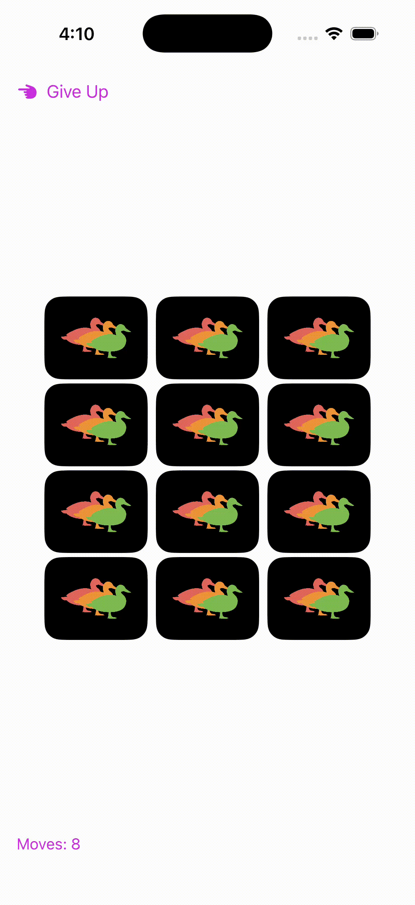

# Three Ducks - Redux Style Card Matching Game

A SwiftUI implementation of a card matching game using Redux-inspired state management patterns. This project demonstrates how to apply Redux concepts to iOS development for predictable and maintainable state management.

This project is based on the tutorial: [Getting a Redux Vibe Into SwiftUI](https://www.kodeco.com/22096649-getting-a-redux-vibe-into-swiftui)

<div align="center">
    
</div>

## 🎮 Game Overview

Three Ducks is a challenging card matching game where players flip cards to find matching pairs of animals. The game features:

- **Three difficulty levels**: Easy (4x3 grid), Normal (4x4 grid), Hard (5x4 grid)
- **Score tracking**: Tracks moves and maintains best scores per difficulty
- **Sound effects**: Quack sounds for card flips and game events
- **Smooth animations**: Card flipping with visual feedback

## 🏗️ Architecture

This project implements Redux-inspired patterns in SwiftUI:

### Core Redux Concepts

- **State**: Immutable app state managed in `ThreeDucksState`
- **Actions**: Dispatched events that describe what happened
- **Reducer**: Pure function that takes state and action, returns new state
- **Store**: Centralized state container that holds the app state
- **Middleware**: Functions that handle side effects (sounds, persistence, game logic)

### Project Structure

```
ThreeDucks/
├── State/                 # Redux-style state management
│   ├── State.swift       # App state definition
│   ├── Action.swift      # Action definitions
│   ├── Reducer.swift     # State reducer
│   └── Store.swift       # Central store
├── Middleware/           # Side effect handlers
│   ├── GameLogicMiddleware.swift
│   ├── BestScoreMiddleware.swift
│   ├── QuackSoundMiddleware.swift
│   └── Middleware.swift
├── Model/                # Data models
│   ├── Card.swift
│   ├── Animal.swift
│   ├── GameState.swift
│   ├── DifficultyLevel.swift
│   ├── Score.swift
│   └── ScorePersistence.swift
├── Views/                # SwiftUI views
│   ├── ContentView.swift
│   ├── TitleScreenView.swift
│   ├── GameScreenView.swift
│   ├── GameWinScreenView.swift
│   ├── CardView.swift
│   ├── CardGridView.swift
│   ├── CardFrontContentView.swift
│   └── CardBackContentView.swift
└── AppMain.swift         # App entry point
```

## 🚀 Key Features

### State Management
- **Immutable State**: All state changes create new state objects
- **Predictable Updates**: State changes only happen through dispatched actions
- **Time Travel Debugging**: State history can be tracked and replayed

### Game Logic
- **Card Matching**: Flip two cards to find matching animal pairs
- **Move Counter**: Tracks number of moves taken
- **Win Detection**: Automatically detects when all pairs are matched
- **Flip Locking**: Prevents rapid card flipping during animations

### Middleware System
- **Game Logic Middleware**: Handles card matching logic and win conditions
- **Score Middleware**: Persists and loads best scores
- **Sound Middleware**: Plays quack sounds for game events

### Difficulty Levels
- **Easy**: 4×3 grid (6 pairs)
- **Normal**: 4×4 grid (8 pairs)  
- **Hard**: 5×4 grid (10 pairs)

## 🛠️ Technical Implementation

### State Definition
```swift
struct ThreeDucksState {
    var gameState: GameState = .title
    var gameDifficulty: DifficultyLevel = .easy
    var cards = [Card]()
    var selectedCards: [Card] = []
    var moves: Int = 0
    var isFlipLocked = false
    var previousBestScore: Score?
}
```

### Action Types
```swift
enum ThreeDucksAction {
    case launch
    case startGame
    case endGame
    case flipCard(Card)
    case clearSelectedCards
    case unFlipSelectedCards
    case winGame
    case setFlipLocked(Bool)
    case setDifficulty(DifficultyLevel)
    case setPreviousBestScore(Score?)
}
```

### Store Configuration
The store is configured with the reducer and middleware in `AppMain.swift`:

```swift
let store = ThreeDucksStore(
    initial: ThreeDucksState(),
    reducer: threeDucksReducer,
    middlewares: [
        gameLogicMiddleware,
        bestScoreMiddleware(using: ScorePersistence()),
        quackSoundMiddleware(using: QuackPlayer())
    ]
)
```

## 🎯 Redux Benefits in SwiftUI

1. **Predictable State**: All state changes are explicit and traceable
2. **Testability**: Pure reducers and middleware are easy to test
3. **Debugging**: State changes can be logged and replayed
4. **Scalability**: New features can be added without affecting existing code
5. **Separation of Concerns**: UI, business logic, and side effects are clearly separated

## 🏃‍♂️ Getting Started

### Prerequisites
- Xcode 12.0+
- iOS 14.0+
- Swift 5.0+

### Installation
1. Clone the repository
2. Open `ThreeDucks.xcodeproj` in Xcode
3. Build and run the project

### Running the Game
1. Launch the app to see the title screen
2. Select difficulty level (Easy/Normal/Hard)
3. Tap "New Game" to start
4. Flip cards to find matching pairs
5. Complete the game to see your score

## 🎨 Customization

### Adding New Animals
1. Add new animal case to `Animal.swift`
2. Add corresponding image assets to `Assets.xcassets`
3. Update the `cards(for:)` function in `Reducer.swift`

### Adding New Difficulty Levels
1. Add new case to `DifficultyLevel.swift`
2. Update the grid size logic in the reducer
3. Add appropriate color coding

### Adding New Middleware
1. Create new middleware function following the `Middleware<State, Action>` type
2. Add to the middleware array in `AppMain.swift`


### Redux Concepts
- [Redux Documentation](https://redux.js.org/)
- [Redux Essentials](https://redux.js.org/tutorials/essentials/part-1-overview-concepts)

### SwiftUI + Combine
- [SwiftUI Documentation](https://developer.apple.com/documentation/swiftui)
- [Combine Framework](https://developer.apple.com/documentation/combine)


## 📄 License

This project is for educational purposes. The original tutorial content is from Kodeco (formerly Ray Wenderlich).

---

*Built with ❤️ using SwiftUI and Redux-inspired architecture*
